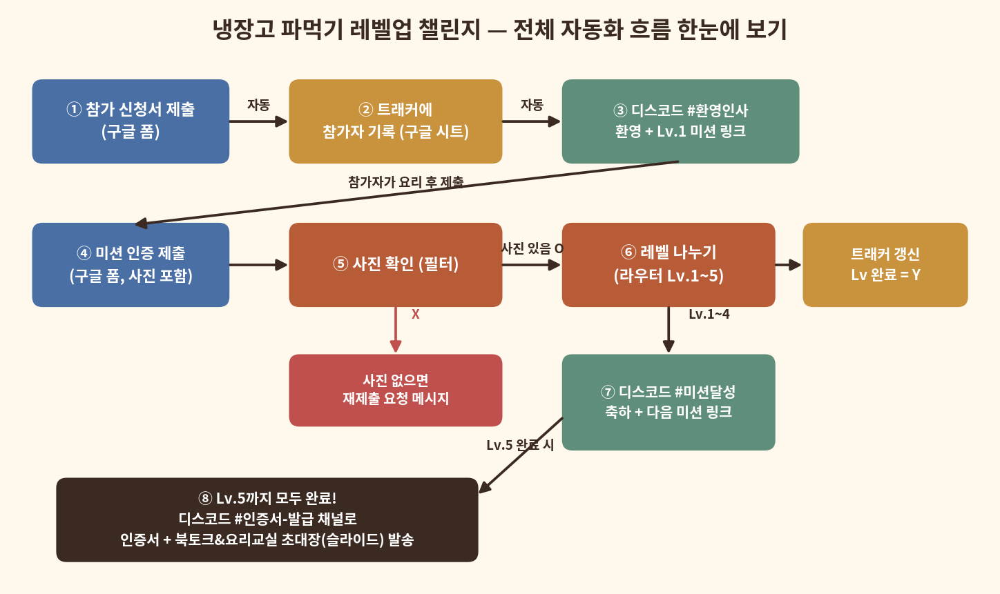
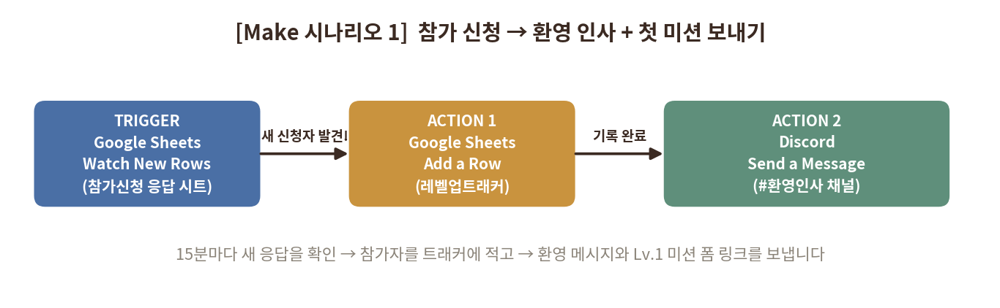
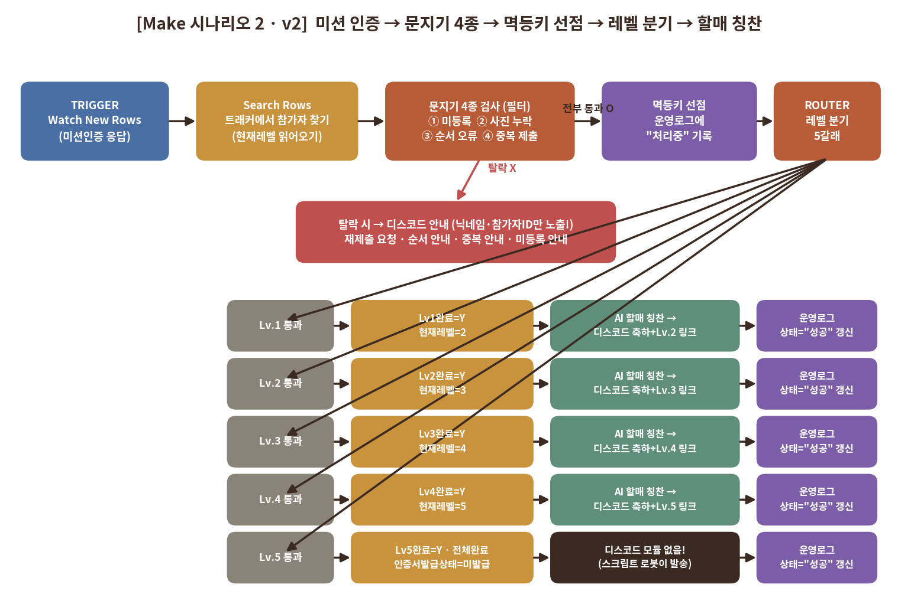
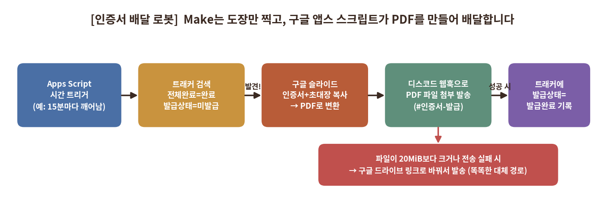
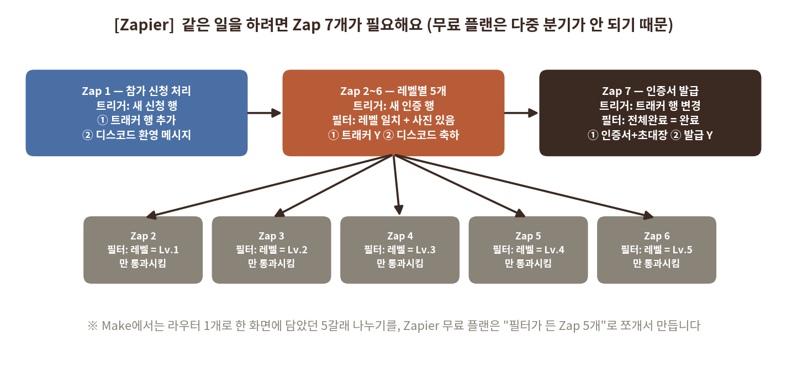

# 냉장고 파먹기 레벨업 챌린지 — Make & Zapier 자동화 구현 가이드 v2 (디스코드 알림 버전)

> **할머니 손맛 레시피북 홍보 이벤트**
> 참가 신청 → 미션 5단계 → 인증서 + 북토크&요리교실 초대장까지, 전부 자동으로!
>
> 작성일: 2026. 7. 27. (v2) | 작성: 김진아
>
> **v2 업데이트:** 멱등키 3단계 안전장치 · 문지기 4종(미등록/사진/순서/중복) · 순자 할매 AI 칭찬 코멘트 · 개인정보 보호 규칙 · Make(도장)+Apps Script(배달) 인증서 구조

---

## 1. 이 이벤트는 무엇인가요? (한눈에 보기)

전라도 할머니가 만든 요리책(레시피북)을 판매하면서, 책을 홍보하기 위한 요리 미션 이벤트를 엽니다. 참가자가 5단계 요리 미션을 모두 성공하면, 상으로 "북토크 & 요리교실"에 참여할 수 있는 초대장을 드립니다. 이 모든 과정(환영 인사, 미션 안내, 축하 메시지, 인증서 발송)을 사람이 일일이 하지 않고, Make와 Zapier라는 자동화 도구가 대신하게 만드는 것이 이 문서의 목표입니다.

| 항목 | 내용 |
|------|------|
| 이벤트 이름 | 냉장고 파먹기 레벨업 챌린지 |
| 이벤트 목적 | 전라도 할머니 레시피북 홍보 및 판매 촉진 |
| 최종 보상 | 전설의 요리사 인증서 + 북토크&요리교실 참여 초대장(구글 슬라이드) |
| 참가 방법 | 구글 폼으로 참가 신청서 제출 |
| 미션 방식 | Lv.1 ~ Lv.5까지 요리 미션을 순서대로 수행하고, 구글 폼으로 사진과 함께 인증 |
| 알림 채널 | 디스코드(Discord) 서버 "냉장고 파먹기 챌린지"의 채널 3개 (#환영인사, #미션달성, #인증서-발급) |
| 자동화 도구 | Make(메인 구현) + Zapier(비교 구현) — 과제 요구사항인 "2개 도구 비교"용 |

### 5단계 미션 (레시피북 콘셉트와 연결)

| 레벨 | 칭호 | 미션 내용 | 통과 조건 |
|------|------|-----------|-----------|
| Lv.1 | 초보 요리사 | 냉장고 속 재료 3가지로 요리 1개 완성 | 인증 사진 필수 |
| Lv.2 | 살림 9단 | 자취요리(라면·볶음밥 등)를 나만의 방식으로 업그레이드 | 인증 사진 필수 |
| Lv.3 | 집밥 마스터 | 메인요리 + 반찬 2개 이상으로 한 상 차리기 | 인증 사진 필수 |
| Lv.4 | 창작 셰프 | 기존 레시피를 응용한 나만의 창작 요리 | 인증 사진 필수 |
| Lv.5 | 전설의 요리사 | "인생 한 끼" — 가장 자신 있는 요리로 마무리 | 인증 사진 필수 |

---

## 2. 전체 자동화 흐름 (그림으로 이해하기)

자동화를 만들기 전에, 먼저 "무슨 일이 어떤 순서로 일어나는지"를 그림 한 장으로 이해해 봅시다. 아래 그림의 번호(①~⑧)를 따라가며 읽어 보세요.



### 그림 속 번호를 말로 풀면 이렇게 됩니다

| 번호 | 무슨 일이 일어나나요? | 누가 하나요? |
|------|----------------------|--------------|
| ① | 참가자가 구글 폼으로 참가 신청서를 낸다 | 참가자 |
| ② | 자동화 도구가 참가자를 "레벨업트래커" 시트에 기록한다 | 자동 (Make/Zapier) |
| ③ | 디스코드 #환영인사 채널에 환영 메시지와 Lv.1 미션 폼 링크가 올라온다 | 자동 |
| ④ | 참가자가 요리를 하고, 미션 인증 폼에 사진과 함께 제출한다 | 참가자 |
| ⑤ | 자동화 도구가 "사진이 있는지" 검사한다 (없으면 다시 올려달라는 메시지) | 자동 (필터) |
| ⑥ | 제출한 레벨(Lv.1~5)에 따라 5갈래로 나뉜다 | 자동 (라우터) |
| ⑦ | 트래커에 완료(Y)를 기록하고, #미션달성 채널에 축하 + 다음 미션 링크를 보낸다 | 자동 |
| ⑧ | Lv.5까지 모두 완료하면 #인증서-발급 채널로 인증서와 초대장(구글 슬라이드)을 보낸다 | 자동 |

> **왜 이렇게 나누나요?** 자동화 도구의 세 가지 기본 부품 때문입니다. **트리거(Trigger)**는 "초인종"처럼 일이 시작됐음을 알려주고, **액션(Action)**은 "심부름꾼"처럼 실제 일을 하고, **필터/라우터(Filter/Router)**는 "갈림길 표지판"처럼 조건에 따라 길을 나눕니다. 위 그림에서 ①·④가 초인종, ②·③·⑦·⑧이 심부름꾼, ⑤·⑥이 갈림길 표지판이에요.

---

## 3. 준비물 체크리스트 (만들기 전에 다 모아두세요)

자동화를 만들기 전에 아래 재료들이 모두 준비되어 있어야 합니다. 요리로 치면 "재료 손질" 단계예요.

| ✔ | 준비물 | 설명 | 어디서 |
|---|--------|------|--------|
| ☐ | 구글 폼 ① 참가 신청서 | 이름, 연락처(또는 디스코드 닉네임), 참가 동기, 개인정보 동의. 응답은 구글 시트에 자동 저장되게 연결 | 구글 폼 |
| ☐ | 구글 폼 ② 미션 인증 폼 (1개로 통합) | 이름, 레벨 선택(Lv.1~5 드롭다운), 인증 사진 업로드(필수), 레벨별 추가 질문. "레벨 선택"이 나중에 라우터의 갈림길 기준이 됨 | 구글 폼 |
| ☐ | 구글 시트 "레벨업트래커" | 참가자별로 Lv.1~5 완료 여부(Y/N), 전체완료여부, 인증서발급여부를 기록하는 표 (제공된 트래커 xlsx를 구글 시트로 업로드) | 구글 시트 |
| ☐ | 디스코드 서버 + 채널 3개 | #환영인사, #미션달성, #인증서-발급 채널 (이미 만들어 둔 서버 사용) | 디스코드 |
| ☐ | 인증서 + 초대장 (구글 슬라이드) | 1페이지: 전설의 요리사 인증서 / 2페이지: 북토크&요리교실 초대장. "링크가 있는 모든 사용자 - 뷰어"로 공유 설정 | 구글 슬라이드 |
| ☐ | 디스코드 웹훅 URL 1개 | #인증서-발급 채널 설정 → 연동 → 웹훅 만들기 → URL 복사. 인증서 배달 스크립트가 PDF를 보낼 때 사용 (비밀값이니 공개 금지) | 디스코드 |
| ☐ | (보너스) AI API 키 | Gemini 또는 OpenAI 키 — "순자 할매 칭찬 코멘트" 자동 생성용. 없어도 기본 문구로 운영 가능 | AI 서비스 |
| ☐ | Make 무료 계정 | make.com 가입 (월 1,000 Ops 무료) | make.com |
| ☐ | Zapier 무료 계정 | zapier.com 가입 (월 100 Tasks 무료 — 아껴 쓰기!) | zapier.com |

### 준비물 만들 때 꼭 지켜야 할 3가지 약속

1. **두 구글 폼 모두 응답을 구글 시트에 연결하세요.** 폼 편집 화면 → "응답" 탭 → 시트 아이콘 클릭. 자동화 도구는 폼이 아니라 이 "응답 시트"를 지켜보고 있다가 새 줄이 생기면 움직입니다.
2. **미션 인증 폼의 "레벨 선택" 답은 반드시 Lv.1, Lv.2 처럼 통일된 글자로 만드세요.** 라우터가 이 글자를 보고 갈림길을 정하기 때문에, "레벨1", "1단계" 등으로 섞여 있으면 길을 잃습니다.
3. **트래커에 "디스코드 닉네임" 열을 만들고 참가 신청서에도 같은 질문을 넣으세요.** 디스코드 메시지에서 누구를 축하하는지 이름을 불러주기 위해 필요합니다.

### 레벨업트래커 시트의 열(컬럼) 구성 (v2)

| 열 이름 | 내용 | 누가 채우나요? |
|---------|------|----------------|
| 참가자ID | FC-0001처럼 부여하는 고유 번호. 디스코드 공개 메시지에는 실명 대신 이 ID와 닉네임만 노출 | 자동 (참가 신청 시) |
| 이름 / 연락처 | 참가자 실명·연락처 — **디스코드에 절대 노출 금지!** | 자동 (참가 신청 시) |
| 디스코드닉네임 | 디스코드에서 부를 이름 | 자동 (참가 신청 시) |
| 신청일 | 참가 신청 날짜 | 자동 (참가 신청 시) |
| 현재레벨 | 지금 도전 중인 레벨(1~5). 순서 오류 검사의 기준 | 자동 (레벨업 시 +1) |
| Lv1완료 ~ Lv5완료 | 각 레벨 통과하면 N → Y | 자동 (미션 인증 시) |
| 전체완료여부 | Lv1~5가 전부 Y면 "완료" (시트 수식으로 자동 계산) | 시트 수식 |
| 인증서발급상태 | 미발급 → 발급완료. Make는 "미발급" 도장만 찍고, 스크립트 로봇이 발송 후 "발급완료"로 바꿈 | 자동 |

> **시트 수식 팁:** 전체완료여부 열에는 `=IF(COUNTIF(...,"Y")=5,"완료","진행중")` 같은 수식을 넣어두면, Lv1~5 열이 모두 Y가 되는 순간 자동으로 "완료"로 바뀝니다. (범위는 실제 Lv1~Lv5 열 위치에 맞게 바꿔주세요)

### 운영로그 탭 (중복 발송을 막는 안전장치)

트래커 옆에 "운영로그"라는 탭을 하나 더 만듭니다. 로봇이 일을 시작하기 전에 여기에 "지금 이 일을 처리중"이라고 먼저 적어두는(선점) 용도예요. 같은 제출이 두 번 들어와도, 이미 적힌 기록을 보고 두 번째 로봇이 스스로 멈춥니다.

| 열 이름 | 내용 | 예시 |
|---------|------|------|
| 멱등키 | "이 일"을 딱 하나로 가리키는 열쇠 문자열 | `PASS\|FC-0001\|L2` |
| 상태 | 처리중 → 성공 (실패 시 실패) | 성공 |
| 참가자ID / 이벤트 | 누가, 무슨 일이었는지 | FC-0001 / 레벨업 |
| 기록일시 | 언제 처리했는지 | 2026-07-27 16:40 |

> **멱등키 규칙:** 레벨업 = `PASS|{참가자ID}|L{레벨}` · 리마인드 = `REMIND|{참가자ID}|L{현재레벨}|D5` · 참가 신청 = `JOIN|{참가자ID}`. 같은 일이면 항상 같은 열쇠가 만들어지도록 규칙을 고정하는 것이 핵심입니다.

---

## 4. Make로 만들기 (메인 구현 — 순서대로 따라 하세요)

### 4-1. 먼저 알아야 할 Make 낱말 사전

Make 화면에 나오는 낱말들을 쉬운 말로 바꿔 봤어요. 이것만 알면 절반은 끝났습니다.

| Make 낱말 | 쉬운 말 | 이번 이벤트에서는 |
|-----------|---------|-------------------|
| 시나리오 (Scenario) | 자동화 한 묶음 (레시피 한 장) | 총 3개를 만듭니다 |
| 모듈 (Module) | 동그란 부품 하나 (레시피의 한 단계) | 구글 시트, 디스코드 등 |
| 트리거 (Trigger) | 일을 시작시키는 초인종 | "새 폼 응답이 생겼다!" |
| 액션 (Action) | 실제 일을 하는 심부름꾼 | 메시지 보내기, 시트에 쓰기 |
| 필터 (Filter) | 통과 조건 검사원 | "사진이 있나요?" |
| 라우터 (Router) | 여러 갈래 갈림길 | "몇 레벨 제출인가요?" → 5갈래 |
| 매핑 (Mapping) | 앞 단계의 값을 뒤 단계에 꽂아 넣기 | 폼의 "이름"을 메시지 속 {이름}에 |
| Ops | Make 사용량 단위 (모듈 1번 작동 = 1 Op) | 무료 = 월 1,000 Ops |

### 4-2. Make와 디스코드 연결하기 (딱 한 번만 하면 됩니다)

1. Make에 로그인 → 왼쪽 메뉴 "Scenarios" → 오른쪽 위 "+ Create a new scenario" 클릭
2. 가운데 큰 + 를 누르고 "Discord"를 검색해 아무 모듈이나 선택 (연결만 미리 해두는 것)
3. "Connection" 칸 옆 "Add" 클릭 → 디스코드 로그인 창이 뜨면 로그인
4. "서버에 봇 추가" 화면이 나오면 서버 목록에서 "냉장고 파먹기 챌린지" 선택 → "승인" 클릭
5. 디스코드 서버 멤버 목록에 Make 봇이 들어왔는지 확인 (봇이 있어야 메시지를 대신 보낼 수 있어요)

> ⚠️ **주의:** 봇을 초대할 때 "채널 보기"와 "메시지 보내기" 권한 체크를 풀지 마세요. 또 비공개 채널이라면 채널 설정 → 권한에서 Make 봇을 직접 추가해야 합니다.

구글 시트도 같은 방법으로 "Google Sheets" 모듈에서 Add → 구글 로그인 → 권한 허용을 한 번만 해두면 계속 쓸 수 있습니다.

### 4-3. 시나리오 1 — 참가 신청이 오면 환영 인사 + 첫 미션 보내기



**모듈 설정표 (이대로 클릭하며 채우면 됩니다)**

| 순서 | 모듈 (앱 > 기능) | 설정 항목 | 넣을 값 / 설명 |
|------|------------------|-----------|----------------|
| 1 | Google Sheets > Watch New Rows (트리거) | Spreadsheet / Sheet | 참가 신청 폼의 응답 시트 선택 ("설문지 응답 시트1") |
| | | Table contains headers | Yes (첫 줄이 제목 줄이므로) |
| | | Limit | 10 (한 번에 최대 10명 처리) |
| | | 시계 아이콘(스케줄) | 15분마다 (Every 15 minutes) |
| 2 | Google Sheets > Add a Row (액션 1) | Spreadsheet / Sheet | 레벨업트래커 시트 선택 |
| | | Values (각 열) | 이름·디스코드닉네임·신청일 ← 1번 모듈의 값을 매핑 / Lv1완료~Lv5완료 열에는 글자 그대로 N 입력 |
| 3 | Discord > Send a Message (액션 2) | Server / Channel | 냉장고 파먹기 챌린지 / #환영인사 |
| | | Message content | 아래 4-6의 "환영 메시지" 문구를 붙여넣고, {디스코드닉네임} 자리에 1번 모듈의 닉네임 값을 매핑 |

**처음 켤 때 딱 한 번 해줄 것**

- 1번 모듈에서 마우스 오른쪽 클릭 → "Choose where to start" → "From now on"을 선택하세요. 이걸 안 하면 옛날 응답까지 전부 처리해서 Ops를 낭비합니다.
- 화면 왼쪽 아래 "Run once"를 눌러 놓고, 테스트용으로 참가 신청 폼을 직접 제출해 보세요. 디스코드에 환영 메시지가 오면 성공!
- 잘 되면 왼쪽 아래 스위치를 ON으로 켜서 "저절로 돌아가는 상태"로 만듭니다.

### 4-4. 시나리오 2 (v2) — 문지기 4종 + 멱등키 + 레벨 분기 (핵심!)

과제의 필터·라우터 요구사항이 모두 이 시나리오에 들어 있습니다. v2에서는 오류 제출을 걸러내는 **문지기 4종**과, 중복 발송을 원천 차단하는 **멱등키 3단계**가 추가됐습니다.



**STEP A. 참가자 찾기 (Search Rows)**

트리거(Watch New Rows) 다음에 Google Sheets > Search Rows를 붙여, 트래커에서 제출자의 행을 찾고 **"현재레벨" 값을 읽어옵니다.** 이 값이 뒤의 순서 오류 검사 기준이 됩니다.

**STEP B. 문지기 4종 정리표 (오류 경로마다 디스코드 안내 1개씩)**

| 문지기 | 걸러내는 조건 | 로봇의 행동 (트래커는 건드리지 않음!) |
|--------|---------------|----------------------------------------|
| ① 미등록 | STEP A 검색 결과가 0개 (참가자를 트래커에서 못 찾음) | 레벨 올리지 않음 → 디스코드: "참가 신청부터 해주세요". 닉네임 자리는 "미등록 플레이어"로 표기 |
| ② 사진 누락 | "인증 사진" 값이 비어있거나, http(s):// 링크·구글 드라이브/문서 링크·20자 이상 드라이브 파일 ID 중 어느 것도 아님 | 레벨 유지 → 디스코드: 재제출 요청 (시스템 코드 `DISCORD_RESUBMIT_REQUIRED`). 잘못 낸 URL은 절대 되돌려 보여주지 않기 |
| ③ 순서 오류 | 제출한 "레벨 선택" 숫자 ≠ 트래커의 "현재레벨" (예: 현재 Lv.1인데 Lv.3 제출) | 레벨·완료값 그대로 유지 → 디스코드: "이전 레벨부터 차례대로!" (`DISCORD_LEVEL_ORDER_NOTICE`) |
| ④ 중복 제출 | 제출한 레벨의 "LvN완료"가 이미 Y (이미 깬 레벨 재제출) | 상태 유지 → 디스코드: "이미 완료한 퀘스트입니다" 안내 |

> **설정 위치:** Make에서 모듈과 모듈을 잇는 선(점선)을 클릭하면 필터 조건을 넣을 수 있습니다. "성공 길"에는 통과 조건(예: 레벨 선택 = 현재레벨)을, 라우터의 "오류 길"에는 걸러내는 조건(예: 레벨 선택 ≠ 현재레벨)을 각각 반대로 걸어주면 됩니다.

**STEP C. 멱등키 3단계 — 중복 발송 원천 차단 (Discord 발송 직전에 반드시!)**

제공된 Blueprint 원본에는 이 안전장치가 없어서, 그대로 운영(Scheduling)을 켜면 같은 축하 메시지가 두 번 갈 위험이 있습니다. Discord 발송 전에 아래 3단계를 꼭 넣어주세요.

| 단계 | 모듈 | 하는 일 |
|------|------|---------|
| 1. 원자적 선점 | Google Sheets > Search Rows + Add a Row | 운영로그 탭에서 멱등키(예: `PASS\|{참가자ID}\|L{레벨}`)를 검색. 없으면 즉시 "상태=처리중"으로 한 줄 추가해 자리를 선점 |
| 2. 차단 필터 | Make Filter | 방금 검색한 멱등키의 상태가 이미 **"처리중"** 또는 **"성공"**이면 → 다른 로봇이 하는 중이거나 끝난 일이므로 이 길을 즉시 종료 (아무것도 안 보냄) |
| 3. 완료 도장 | Google Sheets > Update a Row | Discord 발송이 무사히 끝난 뒤 운영로그 상태를 **"성공"**으로 갱신. 최종 실패 시 "실패"로 기록해 재시도 가능하게 함 |

**STEP D. 라우터 5갈래 — 각 길의 행동**

| 길 | 구글 시트 기록 (Update a Row) | 디스코드 발송 |
|----|-------------------------------|----------------|
| 길 1 (Lv.1) | Lv1완료=Y, 현재레벨=2 | (AI 할매 칭찬 생성 후) 축하 + Lv.2 미션 링크 |
| 길 2 (Lv.2) | Lv2완료=Y, 현재레벨=3 | 축하 + Lv.3 미션 링크 |
| 길 3 (Lv.3) | Lv3완료=Y, 현재레벨=4 | 축하 + Lv.4 미션 링크 |
| 길 4 (Lv.4) | Lv4완료=Y, 현재레벨=5 | 축하 + 마지막 Lv.5 미션 링크 |
| 길 5 (Lv.5) | Lv5완료=Y, 전체완료여부=완료, **인증서발급상태=미발급 ← 가장 중요한 암호!** | **디스코드 모듈을 넣지 않습니다!** 인증서는 스크립트 로봇 담당 (4-5) |

> ⚠️ **왜 길 5에는 디스코드 모듈이 없나요?** PDF 변환·파일 첨부 같은 무거운 일은 Make가 아니라 구글 앱스 스크립트가 맡도록 역할을 나눴기 때문입니다. Make는 "미발급" 도장만 찍으면 끝. 또한 Update a Row를 쓸 때는 바꿀 칸만 채우고 나머지 칸은 비워두세요 — 비워둔 칸은 기존 값이 유지되고, 공백을 입력하면 지워집니다.

### 4-5. 인증서 + 초대장 발급 — Make는 도장, 스크립트가 배달



Make가 트래커에 "인증서발급상태=미발급" 도장을 찍어두면, 별도의 구글 앱스 스크립트 로봇(`issuePendingCertificates` 함수)이 시간이 되면 깨어나 처리합니다. 함께 드린 **"인증서발급_스크립트.gs"** 파일을 사용하세요.

**스크립트 로봇이 하는 일 (자동)**

1. 트래커에서 전체완료여부=완료 AND 인증서발급상태=미발급인 사람을 찾는다
2. 구글 슬라이드(인증서+초대장)를 복사해 이름·닉네임·참가자ID·완료일을 채우고 PDF로 변환한다
3. 디스코드 웹훅으로 #인증서-발급 채널에 PDF 파일을 첨부해 보낸다
4. 파일이 **20MiB보다 크거나 전송에 실패하면 → 구글 드라이브 링크로 바꿔서** 보낸다 (대체 경로 = 보너스 과제 2 충족!)
5. 무사히 보냈으면 트래커의 인증서발급상태를 "발급완료"로 스스로 바꾼다 (중복 발급 방지)

**시간 트리거 설정 (한 번만)**

1. script.google.com에서 "인증서발급_스크립트" 프로젝트를 연다
2. 왼쪽 시계 모양 메뉴(트리거) → 오른쪽 아래 "트리거 추가" 클릭
3. 실행할 함수: `issuePendingCertificates` / 이벤트 소스: **시간 기반** / 주기: 15분 또는 1시간 (운영량에 맞게)
4. 저장 → 권한 승인 → 끝! 이제 Lv.5 완주자가 나오면 자동으로 인증서가 배달됩니다

### 4-6. 순자 할매 AI 칭찬 코멘트 만들기 (보너스 과제 1 충족)

레벨업 축하 메시지에 AI가 요리 사진을 보고 쓴 "할머니 한마디"를 끼워 넣으면 참가자 만족도가 확 올라갑니다. Make에서 Google Gemini(또는 OpenAI) 모듈을 라우터 각 경로의 "트래커 갱신"과 "디스코드 발송" 사이에 넣으세요.

| 설정 항목 | 값 |
|-----------|-----|
| 모듈 | Google Gemini AI > Create a Completion (또는 OpenAI > Create a Chat Completion) |
| 이미지 입력 | 제출된 인증 사진 URL을 이미지 입력으로 매핑 (이미지 인식 가능한 모델 선택) |
| 프롬프트 | 아래 상자의 내용을 그대로 붙여넣기 |
| 출력 사용처 | 응답 텍스트를 디스코드 메시지의 {AI칭찬} 자리에 매핑 |
| 실패 대비 | AI 모듈 오류에도 메시지는 나가야 하므로 "Ignore errors"를 켜고, {AI칭찬}이 비면 기본 문구가 나가게 구성 |

**🍲 AI 프롬프트 (복사해서 붙여넣으세요)**

```
제가 전달하는 요리 완성 사진을 꼼꼼히 살펴보고, 요리의 특징(예: 재료의 색감, 구워진 윤기,
국물의 진한 정도 등)을 잡아내어 2~3줄로 칭찬해 주세요.

조건:
1. 말투는 반드시 구수한 전라도 사투리(~당께, ~혀, ~제, ~것이여 등)를 사용해 주세요.
2. 할머니의 요리 철학인 '맛은 손끝에서 나오는 것이 아니라, 마음에서 나오는 것이여' 또는
   '정성이 들어가야 진짜 맛이 나는 것이당께'와 같은 따뜻한 마음이 느껴지도록 작성해 주세요.
3. 사진에 문제가 있거나 요리가 아니더라도 혼내지 말고 격려해 주세요.
```

> **출력 예시:** "아따, 떡갈비 윤기가 좔좔 흐르는 것이 참말로 곱게 잘 구워졌네! 숯불은 아니어도 정성이 여기까지 느껴진당께!"

### 4-7. 디스코드 메시지 문구 모음 v2 (복사해서 쓰세요)

> 🔒 **모든 문구 공통 보안 규칙:** 디스코드 채널은 모두가 보는 공개 게시판입니다. 노출 가능한 개인 식별 정보는 **챌린지닉네임과 참가자ID 두 가지뿐!** 이메일·실명·전화번호·제출 사진 URL은 어떤 경우에도(오류 안내 포함) 넣지 않습니다. 참가자를 아직 못 찾은 경우에는 닉네임 대신 "미등록 플레이어", 참가자ID 대신 제출 행 번호 같은 비민감 값을 쓰세요.

**① 환영 메시지 (#환영인사 — 시나리오 1)**

```
🎉 {챌린지닉네임} 님, 냉장고 파먹기 레벨업 챌린지에 오신 것을 환영합니다!
🆔 참가자 ID: {참가자ID}
Lv.1부터 Lv.5까지 완주하면 📖 북토크 & 요리교실 초대장을 드려요!

🍳 [Lv.1 미션 — 초보 요리사] 냉장고 속 재료 3가지로 요리 1개 완성!
👉 인증하러 가기: (Lv.1 미션 인증 폼 링크)
```

**② 레벨업 축하 — 순자 할매 상태창 (#미션달성 — Lv.1~4 경로)**

```
🌸 아따~ {챌린지닉네임} 님, 요리 참말로 징하게 잘해부렀당께!

· 🆔 참가자 ID: {참가자ID}
· 📈 현재 진행도: Lv.{완료한레벨} 통과!

💬 순자 할매의 한마디:
{AI칭찬}

요리는 말이여, 레시피보다 정성이 먼저여. 재료 하나하나에 마음을 담아야 진짜 맛이 나는 것이당께!
언능 다음 미션도 해보드라고! 밥 한 끼가 사람을 이어주는 것이여, 알겄제?

🔗 다음 미션하러 가기: {다음미션Form링크}
```

**③ 사진 누락 안내 (#미션달성 — 문지기 ②)**

```
⚠️ {챌린지닉네임} 님, 미션 인증 사진이 확인되지 않습니다!
· 참가자 ID: {참가자ID}
· 안내: 제출하신 링크에 사진이 없거나 접근할 수 없습니다.
  사진이 포함된 올바른 링크로 미션을 다시 제출해 주세요.
(시스템 코드: DISCORD_RESUBMIT_REQUIRED)
```

**④ 순서 오류 안내 (#미션달성 — 문지기 ③)**

```
🛑 {챌린지닉네임} 님, 레벨 순서가 잘못되었습니다!
· 참가자 ID: {참가자ID}
· 지금 도전할 차례는 Lv.{현재레벨}입니다. 이전 레벨부터 차례대로 깨주세요!
(시스템 코드: DISCORD_LEVEL_ORDER_NOTICE)
```

**⑤ 중복 제출 안내 (#미션달성 — 문지기 ④)**

```
💡 {챌린지닉네임} 님, Lv.{제출레벨}은 이미 완료한 퀘스트예요!
· 참가자 ID: {참가자ID}
· 지금 도전할 퀘스트는 Lv.{현재레벨}입니다. 화이팅!
```

**⑥ 미등록 참가자 안내 (#미션달성 — 문지기 ①)**

```
❓ 미등록 플레이어님, 참가 기록을 찾을 수 없어요.
먼저 참가 신청 폼을 제출한 뒤 미션 인증을 올려주세요!
👉 참가 신청하기: (참가 신청 폼 링크)
```

**⑦ 최종 인증서 + 초대장 (#인증서-발급 — 스크립트 로봇 발송)**

```
🏆 {챌린지닉네임} 님, Lv.5까지 모든 퀘스트 완료! "전설의 요리사"가 되셨습니다!
· 참가자 ID: {참가자ID}
📜 인증서와 북토크 & 요리교실 초대장을 첨부합니다. (파일이 크면 드라이브 링크로 드려요)
행사에서 만나요! 밥 한 끼가 사람을 이어주는 것이여~ 🌿
```

### 4-8. 테스트 방법 & 과제 제출용 캡처 체크리스트 (v2)

| 순서 | 테스트 내용 | 캡처할 것 |
|------|-------------|-----------|
| 1 | 테스트 계정으로 참가 신청 폼 제출 | #환영인사 메시지 + Make History (시나리오 1) |
| 2 | Lv.1 인증을 사진 없이 제출 (일부러!) | 재제출 요청 메시지 — "분기 실행 증거 ①" |
| 3 | 참가 신청 없이 미션 폼만 제출 | 미등록 플레이어 안내 — 문지기 ① 작동 증거 |
| 4 | 현재 Lv.1인데 Lv.3을 제출 (일부러!) | 순서 오류 안내(DISCORD_LEVEL_ORDER_NOTICE) + 트래커가 그대로인 것 |
| 5 | Lv.1 인증을 사진과 함께 정상 제출 | 할매 축하 메시지 + 트래커 Lv1완료=Y·현재레벨=2 + 운영로그 `PASS\|…\|L1` = 성공 |
| 6 | 방금 통과한 Lv.1을 한 번 더 제출 | 중복 안내 + 멱등키 덕분에 축하 메시지가 두 번 안 가는 것 |
| 7 | Lv.2~Lv.5 순서대로 제출 | 라우터 5경로 전부 실행 + Lv.5는 트래커에 "미발급" 도장만 찍히는 것 |
| 8 | 스크립트 트리거 주기까지 대기 | #인증서-발급의 PDF 메시지 + 트래커 인증서발급상태=발급완료 |
| 9 | 전체 시나리오 편집 화면 | 모듈 연결 전체 화면 (구성 캡처용) |

> ⚠️ **캡처 시 주의:** Make History에는 이메일·연락처가 보일 수 있습니다. 과제 제출 전 개인정보와 API 키·웹훅 URL은 반드시 모자이크(\*\*\*)로 가리세요.

---

## 5. Zapier로 만들기 (비교 구현)

과제 프로젝트 1은 "같은 워크플로우를 도구 2개로" 만들어야 합니다. Zapier에서는 같은 일을 하는데 구조가 달라져요 — 이 차이가 바로 비교 보고서의 핵심 재료입니다.



> **왜 7개나 필요한가요?** Make의 라우터처럼 한 화면에서 5갈래로 나누는 기능(Paths)이 Zapier에서는 유료입니다. 무료 플랜에서는 "필터"만 쓸 수 있어서, 레벨마다 Zap을 하나씩 만들고 각 Zap의 필터가 자기 레벨만 통과시키게 합니다.

**Zap별 설정표**

| Zap | 트리거 | 필터 | 액션 (순서대로) |
|-----|--------|------|-----------------|
| Zap 1 참가 신청 | Google Sheets — New Spreadsheet Row (참가신청 응답 시트) | (없음) | ① Sheets Create Row (트래커에 새 참가자, Lv1~5=N) ② Discord Send Channel Message (#환영인사, 환영+Lv.1 링크) |
| Zap 2 Lv.1 인증 | Google Sheets — New Spreadsheet Row (미션인증 응답 시트) | 레벨 선택 = Lv.1 AND 인증 사진 Exists | ① Sheets Update Row (Lv1완료=Y) ② Discord 축하+Lv.2 링크 (#미션달성) |
| Zap 3~5 Lv.2~4 인증 | (Zap 2와 동일) | 레벨만 Lv.2 / Lv.3 / Lv.4로 변경 | (Zap 2와 동일, 레벨 숫자만 변경) |
| Zap 6 Lv.5 인증 | (Zap 2와 동일) | 레벨 선택 = Lv.5 AND 인증 사진 Exists | ① Sheets Update Row (Lv5완료=Y, 전체완료=완료, **인증서발급상태=미발급**) ② 디스코드 발송 없음 — 스크립트 로봇이 처리 |

> **Zapier의 한계 메모(보고서용):** 순서 오류 검사처럼 "시트의 현재레벨을 읽어와서 비교"하는 로직은 Zapier 무료에서 단계 수가 늘어나 Task 소모가 큽니다. 멱등키 선점도 같은 구조(Find Row → Filter → Update)로 가능하지만 Zap마다 반복 구성해야 해서, 다단계 검증 자동화에는 Make가 유리하다는 점이 좋은 비교 포인트입니다.

**Zapier에서 디스코드 연결하기**

1. Zap 편집 화면에서 Action 앱으로 "Discord" 검색 → "Send Channel Message" 선택
2. "Sign in to Discord" 클릭 → 디스코드 로그인 → 서버 선택("냉장고 파먹기 챌린지") → 승인 (Zapier 봇이 서버에 들어옵니다)
3. Channel 목록에서 보낼 채널 선택 → Message Text에 문구 작성 (4-6 문구 재사용)

> 💰 **무료 Task 아끼는 요령:** Zapier 무료는 월 100 Tasks뿐입니다. 참가자 1명이 완주하면 약 15 Tasks가 소모돼요. 반복 테스트는 Make에서 충분히 한 뒤, Zapier는 과제 증빙용 최소 횟수만 실행하는 것을 추천합니다. 또 무료 플랜은 트리거 확인 주기가 15분이라 메시지가 최대 15분 늦게 갈 수 있어요.

---

## 6. Make vs Zapier 비교표 (보고서에 바로 쓰세요)

| 비교 항목 | Make | Zapier |
|-----------|------|--------|
| UI/UX | 동그란 모듈을 선으로 잇는 그림판 방식. 5갈래 분기가 한 화면에 다 보임 | 위에서 아래로 내려가는 목록 방식. 단순한 Zap은 쉽지만 분기가 많으면 Zap이 여러 개로 흩어짐 |
| 분기 구현 방식 | 라우터 1개로 5경로 통합 (무료) | 다중 분기(Paths)는 유료 → 필터 + Zap 5개로 분리 |
| 시나리오/Zap 개수 | 시나리오 3개 | Zap 7개 |
| 무료 플랜 | 월 1,000 Ops — 수십 명 규모 챌린지 운영 가능 | 월 100 Tasks — 참가자 6~7명 완주면 소진 |
| 실행 로그 | History에서 모듈별 입출력 데이터를 그림으로 확인 | Zap History를 Zap 7개마다 따로 확인 |
| 디스코드 연동 | 봇 초대 방식, 채널 메시지 발송 간단 | 봇 초대 방식, 동일하게 간단 |
| 초기 진입장벽 | 처음엔 화면이 낯설지만 익숙해지면 관리 편함 | 시작은 더 쉬움. 대신 Zap이 많아지면 관리 부담 |
| 이런 상황에 적합 | 분기 많은 복잡한 자동화, 무료로 많이 실행 | 단순한 2~3단계 자동화를 빠르게 |

**종합 의견(예시):** 이번 챌린지처럼 레벨 5단계 분기가 핵심인 자동화는 라우터를 무료로 쓸 수 있고 실행 한도가 넉넉한 Make가 적합하다. 반면 "폼 제출 → 알림 1개" 수준의 단순 자동화라면 Zapier가 더 빨리 만들 수 있다.

---

## 7. 과제 요구사항 최종 체크리스트

| ✔ | 요구사항 | 이 설계에서 어디에 해당? |
|---|----------|--------------------------|
| ☐ | Trigger 1개 이상 | 시나리오 1·2의 시트 감시 + 스크립트 시간 트리거 |
| ☐ | Action 2개 이상 | 시트 기록 + 디스코드 발송 + AI 생성 등 |
| ☐ | 조건 분기 1개 이상 | 문지기 4종 필터 + 라우터 5갈래 + 멱등키 차단 필터 |
| ☐ | 각 분기 경로 1회 이상 실행 증거 | 4-8 테스트 순서 2~7번 캡처 |
| ☐ | 도구 2개 이상으로 동일 워크플로우 | Make(4장) + Zapier(5장) |
| ☐ | 비교 항목 5개 이상 | 6장 비교표 (8개 항목) |
| ☐ | 보너스 1: AI Action | 4-6 순자 할매 AI 칭찬 코멘트 |
| ☐ | 보너스 2: 실패 대응·대체 경로 | 멱등키 실패 기록·재시도 + 인증서 20MiB 초과 시 드라이브 링크 대체 |
| ☐ | 자동 실행 증거 (프로젝트 2) | History의 타임스탬프 캡처 (Run once가 아닌 자동 실행 기록) |
| ☐ | 민감정보 마스킹 | 캡처 속 이메일·연락처·API 키·웹훅 URL 가리기 |

---

## 8. 자주 막히는 부분 Q&A

| 이런 문제가 생기면 | 이렇게 해결하세요 |
|--------------------|-------------------|
| 폼을 제출했는데 아무 일도 안 일어나요 | ① 시나리오 스위치가 ON인지 ② 폼이 응답 시트에 연결됐는지 ③ 트리거가 보는 시트가 그 응답 시트가 맞는지 ④ 스케줄 주기(15분)가 아직 안 지난 건 아닌지 확인 |
| 옛날 응답까지 한꺼번에 우르르 처리돼요 | 트리거 모듈 오른쪽 클릭 → Choose where to start → From now on |
| 디스코드에 메시지가 안 와요 | 서버 멤버 목록에 Make/Zapier 봇이 있는지, 해당 채널에 봇의 "메시지 보내기" 권한이 있는지 확인 |
| 라우터가 엉뚱한 길로 가요 | 폼의 "레벨 선택" 답안 글자와 필터의 글자가 완전히 같은지 확인 (띄어쓰기·대소문자 포함, "Lv.1" ≠ "LV1") |
| 트래커에서 참가자 줄을 못 찾아요 | Search Rows의 검색 값(이름)이 트래커의 표기와 같은지 확인. 동명이인이 걱정되면 "디스코드닉네임"으로 검색 기준을 바꾸세요 |
| 인증 사진이 시트에 이상한 주소로 보여요 | 정상입니다! 구글 폼 파일 업로드는 시트에 "드라이브 링크"로 저장돼요. 필터는 링크/파일 ID 형태인지만 검사하면 됩니다 |
| 축하 메시지가 두 번 왔어요 | 멱등키 3단계(선점→차단→성공 기록)가 Discord 발송 앞에 있는지, 운영로그에 "처리중"이 먼저 남는지 확인 |
| 순서 오류 필터가 작동 안 해요 | Search Rows가 트래커의 "현재레벨"을 제대로 읽어오는지, 비교 시 숫자(numeric) 연산자로 비교하는지 확인 |
| 트래커의 다른 칸이 지워졌어요 | Update a Row에서 바꿀 칸만 채우고 나머지는 반드시 비워두세요 (공백 입력 = 삭제) |
| 인증서가 안 와요 | 트래커에 "미발급" 도장이 찍혔는지 → 스크립트 시간 트리거가 설치됐는지 → Apps Script 실행 기록에서 오류 확인 |
| 같은 사람에게 인증서가 두 번 갔어요 | 스크립트가 발송 후 "발급완료"로 갱신하는지 확인. 처리 중에 수동 실행을 겹쳐 돌리지 않기 |
| AI 칭찬이 비어 있어요 | AI 모듈 오류 시에도 메시지는 나가도록 기본 문구 준비. API 키·이미지 URL 매핑 확인 |

---

*이 문서 하나로 준비물 → Make 구현 → Zapier 구현 → 비교 보고서 → 과제 체크까지 끝낼 수 있도록 구성했습니다. 막히는 화면이 있으면 그 화면을 캡처해서 질문해 주세요!*
